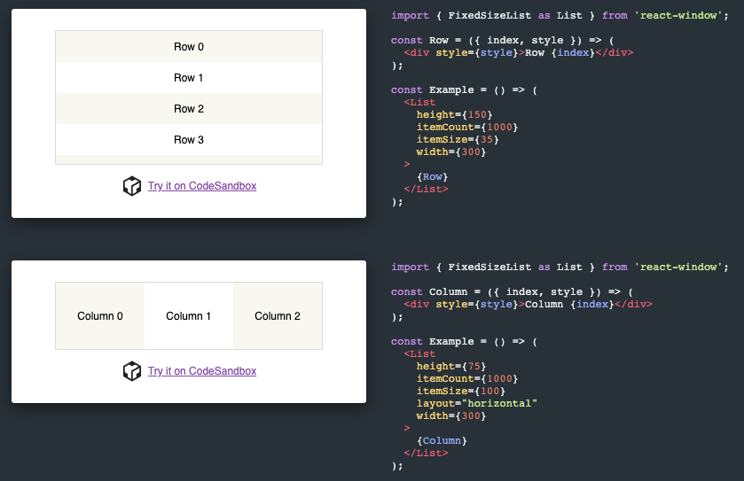
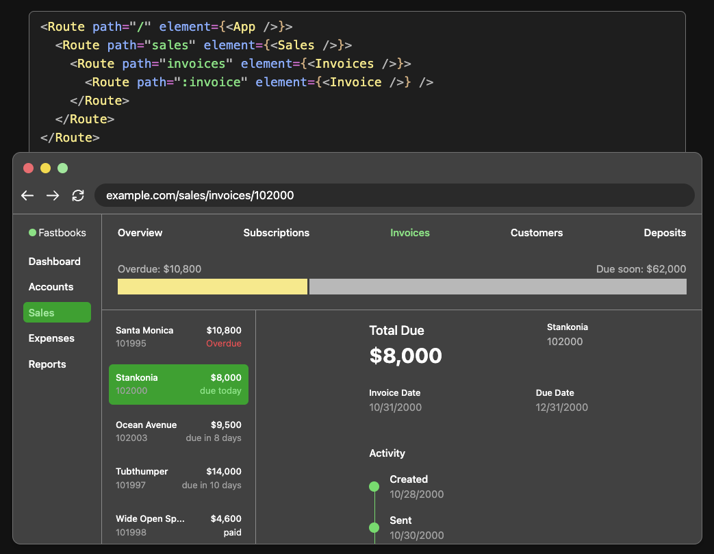

# Frontend resources

## React

### Components

#### React-Toastify

[React-Toastify](https://www.npmjs.com/package/react-toastify?s=03) allows you to add notifications to your app with ease. No more nonsense!

#### Framer Motion

[Framer Motion](https://www.framer.com/motion/) a production-ready motion library for React.

#### React Spinners

[React Spinners](https://www.npmjs.com/package/react-spinners) a collection of loading spinners with React.

#### React Select

[React Select](https://react-select.com/home) a flexible and beautiful Select Input control for ReactJS with multiselect, autocomplete, async and creatable support.

#### React Splide

[React Splide](https://www.npmjs.com/package/@splidejs/react-splide?s=03) a lightweight, flexible and accessible slider and carousel.

#### React Window

[React Window](https://github.com/bvaughn/react-window) components for efficiently rendering large lists and tabular data.

### Hooks

#### React Hook Form

[React Hook Form](https://react-hook-form.com/) performant, flexible and extensible forms with easy-to-use validation.

#### React Table

[React Table](https://react-table.tanstack.com/) build and design powerful datagrid experiences while retaining 100% control over markup and styles.

#### React Query

[React Query](https://react-query.tanstack.com/) fetch, cache and update data in your React and React Native applications all without touching any "global state".

### State Management

#### Zustand

[Zustand](https://www.npmjs.com/package/zustand) a small, fast and scalable bearbones state-management solution using simplified flux principles. Has a comfy api based on hooks, isn't boilerplatey or opinionated.

### Routing

#### React Router

[React Router](https://reactrouter.com/) a decade of client-side routing.

### Component libraries

#### Radix

[Radix](https://www.radix-ui.com/), unstyled, accessible components for building high‑quality design systems and web apps in React.

#### React Suite

[React Suite](https://rsuitejs.com/) a suite of React components, sensible UI design, and a friendly development experience.

#### Chakra UI

[Chakra UI](https://chakra-ui.com/) a simple, modular and accessible component library that gives you the building blocks you need to build your React applications.

